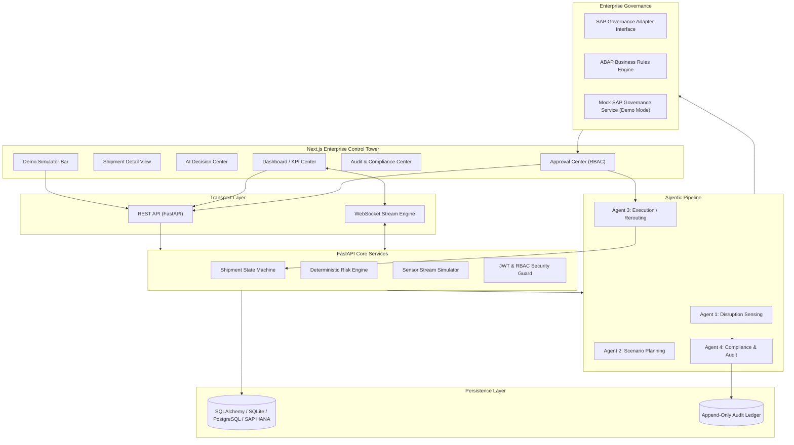
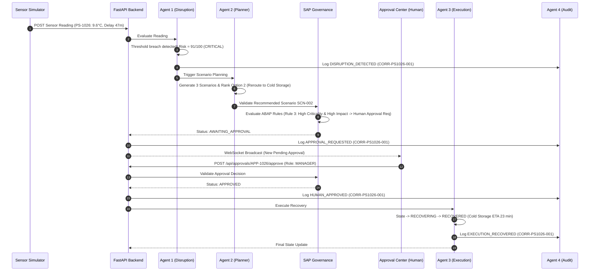

# PharmaShield — Technical Architecture Specification

## 1. Executive Summary & Core Paradigm
PharmaShield is an AI-powered agentic platform engineered for pharmaceutical cold-chain resilience. It continuously monitors shipment signals (temperature, humidity, GPS, delay, traffic), detects disruption events deterministically, calculates risk scores, plans AI-driven recovery scenarios, enforces SAP enterprise business rules, requires human-in-the-loop authorization for high-impact recovery actions, executes approved rerouting workflows, and records an append-only audit trail.

**Core Paradigm:** *AI recommends. SAP governs. Humans approve. The system executes and audits.*

---

## 2. High-Level System Architecture

---

## 3. Component Architecture & System Layers

### 3.1 Frontend Layer (Next.js 14 App Router)
- **Tech Stack:** React 18, TypeScript, Tailwind CSS, Lucide React, Recharts, Leaflet / React-Leaflet.
- **Design Aesthetic:** Dark navy command & control UI (`#0B0F19` background, cyan `#06B6D4` accents, blue `#3B82F6` primary, green `#10B981` success, amber `#F59E0B` warning, red `#EF4444` critical).
- **Key Modules:**
  - `/dashboard`: KPI cards, shipment table, live map, alerts sidebar.
  - `/shipments/[shipment_id]`: Telemetry graphs, threshold zone overlay, risk gauge, agent progress bar.
  - `/decisions`: 9-step pipeline visualization showing step status, confidence, and output payload.
  - `/approvals`: Approval card interface for `MANAGER`/`ADMIN` role with financial & operational impact metrics.
  - `/audit`: Filterable timeline view with correlation ID tracking.

### 3.2 Backend Layer (FastAPI & Python 3.12)
- **Tech Stack:** FastAPI, Pydantic v2, SQLAlchemy 2.0, PyJWT, passlib.
- **Key Subsystems:**
  - `ShipmentStateMachine`: Central state transition validator. Allowed paths: `NORMAL` -> `WARNING` -> `CRITICAL` -> `AWAITING_APPROVAL` -> `APPROVED` -> `RECOVERING` -> `RECOVERED` (or `REJECTED`).
  - `RiskEngine`: Transparent multi-factor risk calculator yielding scores from `0` to `100` mapped to `LOW`, `MEDIUM`, `HIGH`, `CRITICAL`.
  - `WebSocketEngine`: Real-time broadcaster pushing live sensor ticks and state mutations to connected frontend clients.

### 3.3 Agent Architecture
1. **Agent 1 — Disruption Sensing Agent:**
   - Detects safe range breaches (e.g. >8.0°C or <2.0°C for 2°C–8°C products), analyzes temperature trend, checks delay, and outputs structured `disruption_detected` payload with risk score.
2. **Agent 2 — Scenario Planning Agent:**
   - Evaluates disruption event & available recovery options (Option 1: Continue route; Option 2: Reroute to nearest cold storage; Option 3: Replace refrigeration unit). Ranks options and generates explainable reasoning.
3. **Agent 3 — Execution / Rerouting Agent:**
   - Validates that human approval requirements have been met, transitions shipment state to `RECOVERING`, updates simulated GPS coordinates & ETA, completes recovery to `RECOVERED`.
4. **Agent 4 — Compliance & Audit Agent:**
   - Append-only event tracker that tags every single system interaction with a unique correlation ID (`CORR-PS1026-001`).

### 3.4 Governance & SAP Interface Layer
- **SAP Governance Interface (`SAPGovernanceService`):**
  - Evaluates ABAP rules prior to execution.
  - Checks if human approval is mandatory based on cost threshold, criticality, and severity.
  - Rejects unauthorized or unapproved execution attempts.
- **Mock SAP Governance Service (`MockSAPGovernanceService`):**
  - Fully implements the interface for local hackathon demo execution. Clearly tagged in responses as MOCK/DEMO mode.

---

## 4. Primary Hackathon Scenario Sequence Diagram

---

## 5. Security & Safety Principles
1. **Deterministic AI Safety:** Threshold breaches and governance rules are hard-coded in Python/ABAP logic; LLMs cannot override safety rules.
2. **Role-Based Access Control (RBAC):** Approvals require `MANAGER` or `ADMIN` role. Operators and Auditors cannot approve high-impact actions.
3. **Immutable Audit Trail:** Audit logs are append-only. History cannot be updated or deleted.
